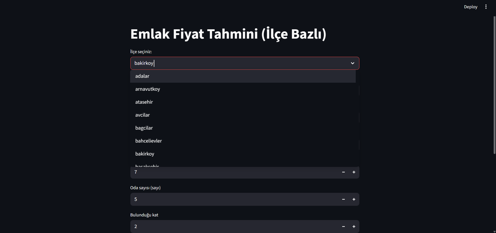
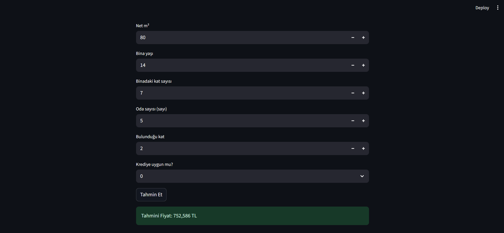

# 🏘️ Istanbul District House Price Predictor

This project is a **Streamlit web app** that predicts **house prices in Istanbul districts** using **machine learning**.  
The model is trained using **RandomForestRegressor** with real estate data.

Users can select district and input property features to get price predictions.

---

## 🏡 Features

- Select **district** from Istanbul
- Input **gross area (m²)** and **net area (m²)**
- Input **building age**
- Input **total floors in the building**
- Input **number of rooms**
- Input **floor location of the apartment**
- Select if the property is **eligible for credit**

The app predicts the **expected house price** based on these inputs.

---

## 📷 Screenshots





---

## 🔧 Technologies

- **Python**
- **Pandas**
- **Scikit-Learn (RandomForestRegressor)**
- **Joblib**
- **Streamlit**

---

## 🚀 How to Run

```bash
git clone https://github.com/fatmaturan/district-price-predictor.git
cd district-price-predictor
pip install -r requirements.txt
streamlit run app.py

